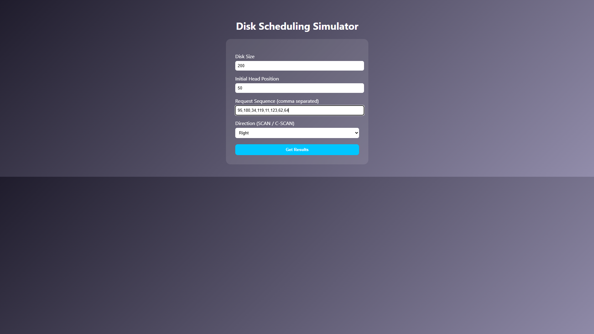

# Advanced Disk Scheduling Simulator

A web-based disk scheduling simulator that implements and compares:

- FCFS (First Come First Serve)
- SSTF (Shortest Seek Time First)
- SCAN (Elevator Algorithm)
- C-SCAN (Circular SCAN)

## Features

- User-defined disk size
- Custom head position
- Custom request sequence
- Performance metrics:
  - Total Seek Time
  - Average Seek Time
  - Throughput
- Clean UI with structured result display

---

## Algorithms Implemented

### 1. FCFS
Serves requests in the order they arrive.
Simple but inefficient.

### 2. SSTF
Selects the closest request next.
Efficient but may cause starvation.

### 3. SCAN
Moves head in one direction until the end, then reverses.
Reduces starvation compared to SSTF.

### 4. C-SCAN
Moves in one direction only and jumps back.
Provides uniform waiting time.

---

## How to Run

1. Download the repository.
2. Open `index.html` in any browser.
3. Enter disk parameters.
4. Click "Get Results".

No installation required.

---

## Sample Test Case

Disk Size: 200  
Head Position: 50  
Requests: 95,180,34,119,11,123,62,64  

---

## Screenshots

### Input Page

### Result Page

---

## Project Structure

index.html
result.html
style.css
script.js

---

## Author

Rehaman D

